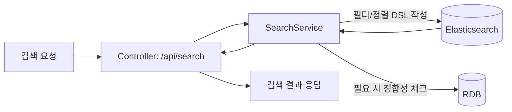

## Elasticsearch 검색 구성 가이드

상품/셀러/주문 등 검색 기능을 엘라스틱서치로 분리할 때 필요한 최소 단계와 실행 명령을 정리했습니다. 아래 흐름도를 따라가며 인프라 → 의존성 → 설정 → 도메인 매핑 → API 순으로 진행하면 됩니다.

### 빠른 실행 흐름도



### 1. 로컬 엘라스틱서치 실행

- 도커 단일 노드 예시 (보안 비활성화, 개발용)

  ```bash
  docker run -d --name shop-es -p 9200:9200 \
    -e "discovery.type=single-node" \
    -e "xpack.security.enabled=false" \
    docker.elastic.co/elasticsearch/elasticsearch:8.15.3
  ```

- 헬스 체크

  ```bash
  curl http://localhost:9200
  ```
  
- nori 추가
  ```commandline
    docker exec shop-es elasticsearch-plugin install analysis-nori                               ░▒▓ INT ✘
    docker restart shop-es
  ```

### 2. Gradle 의존성 추가

`build.gradle` `dependencies` 블록에 검색 모듈을 추가합니다.

```groovy
implementation 'org.springframework.boot:spring-boot-starter-data-elasticsearch'
```

### 3. 스프링 설정 추가

`src/main/resources/application.yaml`에 엘라스틱 엔드포인트를 등록합니다.

```yaml
spring:
  elasticsearch:
    uris: http://localhost:9200
    connection-timeout: 1s
    socket-timeout: 3s
```

- 클러스터 보안이 켜진 경우 `username`, `password`, `ssl.bundle` 등을 함께 지정합니다.

### 4. 인덱스/매핑 정의

- 상품 기준 예시

```shell
curl -X PUT http://localhost:9200/shop-products -H "Content-Type: application/json" -d '
{
  "settings": {
    "number_of_shards": 3,
    "number_of_replicas": 0
  },
  "mappings": {
    "properties": {
      "id": {"type": "keyword"},
      "name": {"type": "text", "analyzer": "nori"},
      "brand": {"type": "keyword"},
      "category": {"type": "keyword"},
      "price": {"type": "integer"},
      "updatedAt": {"type": "date"}
    }
  }
}'
```

- 상품 등록

```shell
cat <<'EOF' | curl -X POST http://localhost:9200/shop-products/_bulk \
    -H "Content-Type: application/x-ndjson" \
    --data-binary @-
{"index":{"_id":"sku-1001"}}
{"id":"sku-1001","name":"남자 러닝화","brand":"SHOP","category":"shoes","price":79000,"updatedAt":"2025-03-01T00:00:00Z"}
{"index":{"_id":"sku-1002"}}
{"id":"sku-1002","name":"여자 샌들","brand":"SHOP","category":"sandals","price":49000,"updatedAt":"2025-03-02T00:00:00Z"}
EOF
```

- 상품 등록(ID 제외)

```shell
cat <<'EOF' | curl -X POST http://localhost:9200/shop-products/_bulk \
    -H "Content-Type: application/x-ndjson" \
    --data-binary @-
{"index":{}}
{"name":"남자 셔츠","brand":"SHOP","category":"shirts","price":59000,"updatedAt":"2025-03-03T00:00:00Z"}
{"index":{}}
{"name":"남자 코트","brand":"SHOP","category":"outer","price":129000,"updatedAt":"2025-03-04T00:00:00Z"}
EOF
```

- 상품 전체 검색

```shell
curl "http://localhost:9200/shop-products/_search?pretty" \
    -H "Content-Type: application/json" \
    -d '{"query":{"match_all":{}}}'
```

- 상품 검색

```shell
curl "http://localhost:9200/shop-products/_search?pretty" \
    -H "Content-Type: application/json" \
    -d '{"query":{"match":{"name":"남자 신발"}}}'
```

- 의미 요약: `PUT /shop-products`로 인덱스를 만들면서 필드별 색인 방식 지정
  - `id`: `keyword` → 분석 없이 원문 저장, 정확 일치/정렬/집계용
  - `name`: `text` + `analyzer: nori` → 한글 형태소 토큰화로 풀텍스트 검색용
  - `brand`, `category`: `keyword` → 필터/집계에 사용
  - `price`: `integer` → 숫자 범위/정렬
  - `updatedAt`: `date` → 날짜 필터/정렬

- 실서비스에서 한글 형태소가 필요하면 `analysis-nori` 플러그인 또는 사전이 포함된 이미지로 교체합니다.

### 5. 코드 뼈대 (예시)

- 도메인 문서: `com.example.shop.search.ProductDocument`

```java
@Document(indexName = "shop-products")
public record ProductDocument(
    @Id String id,
    String name,
    String brand,
    String category,
    Integer price,
    Instant updatedAt
) {}
```

- 리포지토리: `ProductSearchRepository extends ElasticsearchRepository<ProductDocument, String>`
- 서비스: `SearchService`에서 `NativeQueryBuilder` 로 DSL 작성 후 `operations.search(...)` 사용
- 컨트롤러: `/api/search/products?keyword=...&category=...` 형태로 서비스 호출

필요 시 동기화 배치(카프카 리스너/배치 잡)로 RDB → ES 색인을 업데이트합니다.

### 6. 동작 확인

1. 샘플 문서 색인

   ```bash
   curl -X POST http://localhost:9200/shop-products/_doc/sku-1001 -H "Content-Type: application/json" -d '{
     "name": "스니커즈 런너",
     "brand": "SHOP",
     "category": "shoes",
     "price": 79000,
     "updatedAt": "2025-03-01T00:00:00Z"
   }'
   ```

2. 검색 API 호출 (컨트롤러 구현 후)

   ```bash
   curl "http://localhost:8080/api/search/products?keyword=스니커즈&category=shoes"
   ```

3. 구현된 부트 엔드포인트 요약

   - 컨트롤러: `com.example.shop.search.ProductSearchController` (`GET /api/search/products`)
   - 서비스: `SearchService#searchProducts(keyword, category, pageable)`
   - 도메인/리포지토리: `ProductDocument`, `ProductSearchRepository`
   - 파라미터: `keyword`(optional), `category`(optional), `page/size/sort`(Spring Pageable 기본 지원)
   - 응답 예시

     ```json
     {
       "total": 1,
       "items": [
         {
           "id": "sku-1001",
           "name": "스니커즈 런너",
           "brand": "SHOP",
           "category": "shoes",
           "price": 79000,
           "updatedAt": "2025-03-01T00:00:00Z"
         }
       ]
     }
     ```

### 7. 운영 시 고려사항

- **색인 전략**: RDB → ES 전송 경로를 카프카 이벤트로 표준화하면 실시간/비동기 색인 모두 대응 가능
- **일관성**: 주문/상품 업데이트 시 ES와 RDB의 상태 차이를 줄이기 위해 이벤트 버스나 outbox 패턴 고려
- **모니터링**: `/_cluster/health`, `/_cat/indices` 체크 후 문제 발견 시 재색인 스크립트를 준비
- **성능**: 다중 조건 검색은 `bool` + `filter` 조합으로 캐시를 활용하고, 정렬 컬럼은 `doc_values` 확인
