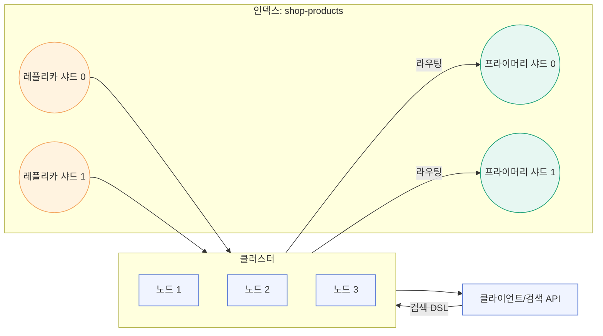

## Elasticsearch 구조 요약

엘라스틱서치는 분산 검색/분석 엔진으로, 데이터 저장 단위와 분산 단위를 명확히 구분합니다. 다이어그램과 표로 핵심 개념을 한눈에 볼 수 있게 정리했습니다.

### 전체 구조 흐름도



### 용어 한눈에 보기

| 개념 | 의미 | 비고 |
| --- | --- | --- |
| 클러스터 | ES 노드들의 집합 | 이름으로 묶이며 검색/색인 라우팅 수행 |
| 노드 | ES 서버 프로세스 한 개 | `node.roles`로 역할 분리 가능 |
| 샤드 | 인덱스를 수평 분할한 물리 단위 | 기본(primary) + 복제(replica) |
| 인덱스 | 논리 저장소 이름 | 내부적으로 여러 샤드로 구성 |
| 매핑 | 인덱스 필드 스키마/분석 방식 | 타입, analyzer, doc_values 등 |
| 문서 | 저장되는 JSON 한 건 | `_id`, `_source` 보유 |
| 필드 | 문서의 속성 | `keyword`/`text`/`date` 등 타입 지정 |
| 분석기 | 텍스트 토큰화·정규화 규칙 | tokenizer + token_filter 조합 |
| QPS | 초당 쿼리 수 | 트래픽 규모를 나타내는 지표 |

### 용어별 한 줄 설명
- **클러스터**: 여러 대의 ES가 한 팀이 되어 일하는 그룹 이름.
- **노드**: ES 프로그램이 돌아가는 서버 1대. 사람이면 팀원 한 명.
- **샤드**: 큰 인덱스를 쪼갠 데이터 조각. 박스를 여러 개 두고 나눠 담는 느낌.
- **메타데이터**: “어떤 샤드가 어디에 있는지, 인덱스 이름이 무엇인지” 같은 지도/목록 정보. 실제 데이터가 아니라 위치·설정 정보.
- **매핑**: 필드의 타입과 처리 규칙을 적어 둔 설계도.

### 노드(Node) 자세히 보기
- **정의**: 클러스터를 구성하는 단일 ES 인스턴스(서버 프로세스). 각 노드가 데이터를 저장하거나 클러스터 관리를 수행.
- **주요 역할(`node.roles`)**
    - `master`: 클러스터 메타데이터/샤드 할당 관리. 3개 이상의 마스터 후보가 있으면 split-brain을 막기 용이.
    - `data`: 샤드를 보유하고 색인/검색 쿼리를 실행. `data_hot/warm/cold/content` 등 스토리지 티어로 세분화 가능.
    - `ingest`: 파이프라인(ingest pipeline) 처리 전용.
    - `ml`, `transform`, `remote_cluster_client` 등 특수 역할을 추가할 수 있음.
- **단일 노드 vs 멀티 노드**
    - 개발/테스트: 단일 노드(`discovery.type=single-node`)로 빠르게 띄우고 레플리카 0.
    - 운영: 최소 3마스터 + N 데이터 노드 구성으로 가용성 확보. 레플리카를 1 이상 두어 장애 시 읽기/복구 가능.
- **노드 선택 시 고려**: JVM 힙(50% 룰), 디스크 수명/IOPS, 네트워크 대역폭, 역할별 분리로 장애 전파 최소화.

### 인덱스 · 매핑 · 문서
- **인덱스(Index)**: RDB 테이블/DB에 대응하는 논리 저장소.
- **매핑(Mapping)**: 필드 타입/분석기 정의(`keyword`, `text+nori`, `date`, `integer` 등).
- **문서(Document)**: `_id`로 식별되는 JSON 레코드, `_source`에 원본 저장.

### 분석(Analysis) 파이프라인
- **분석기(Analyzer)** = `tokenizer` + `token_filter` 세트.
  - 예: `nori` 토크나이저 → `lowercase` → 필요 시 `stop`/`synonym`.
- **색인 시 / 검색 시 분석**: 동일 분석기를 쓰면 정확 매칭, 검색 시만 다르게 하면 유연 매칭.

### 색인·검색 동작 흐름
- **색인(저장)**: `POST/PUT /{index}/_doc/{id}` → 인덱스 → 샤드 → 세그먼트 기록 후 레플리카로 복제.
- **검색**: 쿼리 브로드캐스트 → 샤드별 실행 → 결과 머지/정렬 → 응답.
- **검색 DSL**: `match`/`term`/`bool`/`range`/`agg` 등 JSON 기반 쿼리.

### 주요 관리 API
- 인덱스 생성: `PUT /{index}` (+ 매핑/세팅)
- 매핑 확인: `GET /{index}/_mapping`
- 상태 확인: `GET /_cluster/health`, `GET /_cat/indices`, `GET /_cat/shards`
- 설정 변경(동적): `PUT /{index}/_settings` (동적 가능 항목만)

### 설계 체크리스트
- 샤드/레플리카: 데이터량·QPS(초당 쿼리 수) 대비 적정 수 설정. 단일 노드는 레플리카 0으로 시작.
- 매핑: `text` vs `keyword` 구분, 날짜/숫자 타입 명시, 불필요 필드는 `index: false` 고려.
- 분석기: 언어별 형태소/동의어 필요 여부 결정. 한국어는 `nori` 또는 사전 포함 이미지 사용.
- 일관성: `refresh_interval` 조정, 필요한 경우 `refresh=true`나 버전 기반 동시성 제어 사용.
- 리소스: JVM 힙(물리 메모리 50% 이하), 디스크 모니터링, 스냅샷 백업 설정.

### 데이터 흐름과 왜 빠른가

```mermaid
flowchart LR
    subgraph 저장(색인 흐름)
        C1[클라이언트 요청] --> A1[코디네이터 노드]
        A1 --> B1[분석기(Tokenizer+Filter)]
        B1 --> P1[프라이머리 샤드]
        P1 --> SEG1[Lucene 세그먼트]
        P1 --> R1[레플리카 샤드]
    end
    subgraph 검색 흐름
        C2[검색 요청] --> A2[코디네이터 노드]
        A2 --> S1[샤드 0]
        A2 --> S2[샤드 1]
        S1 & S2 --> M[결과 머지/정렬] --> C2
    end
```

- 저장(색인) 흐름: 문서가 들어오면 **분석기**로 단어를 쪼개고 정규화 → 프라이머리 샤드에 기록 → 레플리카 샤드로 복제 → Lucene 세그먼트(불변 파일)로 저장.
- 검색 흐름: 코디네이터가 모든 샤드에 쿼리를 보냄 → 샤드별로 빠르게 검색 → 결과를 합쳐 정렬 후 반환.

**빠른 이유**
- **역색인**: “단어 → 포함한 문서 목록” 구조라 원하는 단어가 있는 문서를 바로 찾음.
- **병렬 샤딩**: 여러 샤드가 동시에 검색을 수행해 데이터가 많아도 확장 가능.
- **캐시/컬럼형(doc_values)**: 정렬·집계에 맞는 저장방식과 캐시로 디스크 접근을 줄임.
- **불변 세그먼트**: 잠금 충돌이 적고, 백그라운드 머지로 처리.

예시)
- “신발”을 검색하면: `신발` 토큰 → 역색인에서 해당 토큰이 있는 문서 ID 리스트 바로 조회 → 샤드별로 상위 점수 문서를 가져와 합침.
- 가격 정렬 시: `price` 필드가 `doc_values`로 저장되어 있어 컬럼형 접근으로 빠르게 정렬/집계.
- 다중 샤드: `shop-products`가 샤드 4개면 4개가 동시에 검색을 수행하므로 단일 샤드 대비 최대 4배 가까운 처리량 확보(오버헤드는 존재).

### 한국어 예시: “남자 신발” 검색
- 매핑: `name` 필드를 `text + nori` 분석기로 설정.
- 색인 시: “남자 신발 러닝화” → nori 토큰화 → `남자`, `신발`, `러닝화` 등으로 역색인 생성.
- 검색 시: “남자 신발” → 같은 분석기로 `남자`, `신발` 토큰화 → 두 토큰을 포함한 문서를 역색인에서 찾아 점수 계산.
- 기본 `match`는 OR(둘 중 하나 포함)이며, 둘 다 포함하려면 DSL에서 `operator: "and"`를 주거나 bool must로 구성.

샘플 DSL (둘 다 포함 AND 검색):
```json
POST /shop-products/_search
{
  "query": {
    "match": {
      "name": {
        "query": "남자 신발",
        "operator": "and"
      }
    }
  }
}
```

### 샤드에서 “남자 신발” 검색이 처리되는 방식
- 인덱스가 샤드 4개라면 `shop-products`는 샤드0~샤드3에 데이터가 나뉘어 저장됨(프라이머리+레플리카).
- 쿼리 흐름: 코디네이터 노드가 `남자`, `신발` 토큰을 포함한 검색 요청을 **모든 샤드**에 브로드캐스트 → 각 샤드가 자기 안의 역색인을 검색해 상위 N개 결과를 반환 → 코디네이터가 이를 머지/정렬해 최종 상위 결과를 응답.
- 즉, “남자 신발”이라는 텍스트를 샤드 단위로 쪼개는 것이 아니라, **데이터가 샤드마다 나뉘어** 있고 동일한 검색이 병렬로 실행된 뒤 결과를 합칩니다.

### 샤드가 데이터를 어떻게 저장하고 응답하나
- 문서(한 레코드)는 **통째로 하나의 프라이머리 샤드**에 저장되고, 그 복사본이 레플리카에 저장됩니다. 내용이 샤드 내부에서 다시 쪼개지지는 않습니다.
- 어떤 샤드로 갈지는 `_id` 해시(또는 routing 키)로 결정돼 균등 분산됩니다.
- 샤드 내부에서는 Lucene 역색인 구조로 토큰→문서ID 맵을 만들어 둡니다. (토큰화는 **검색용 인덱스 구조**를 만드는 것이지, 문서를 샤드 사이로 쪼개는 게 아닙니다.)
- 검색 시: 모든 샤드가 자신이 가진 문서 중 조건에 맞는 문서ID/점수를 계산해 코디네이터에 반환 → 코디네이터가 이를 합쳐 최종 순위를 정하고 `_source`(원본 JSON)를 포함해 응답합니다.

### 예시: “남자 신발” 문서가 저장·검색될 때
- 저장: “남자 신발” 문서가 한 샤드에 통째로 저장되고 `_source`로 보관됩니다.
- 샤드 내부 역색인: nori 분석기로 `남자`, `신발` 토큰을 추출해 **토큰 → 문서ID 목록**으로 매핑을 만듭니다.
- 검색: “남자” 검색 시 각 샤드는 자기 역색인에서 `남자` 토큰이 가리키는 문서ID를 바로 찾아 반환하고, 코디네이터가 결과를 합쳐 응답합니다. 문서 내용 자체는 샤드 간에 쪼개지지 않으며, `_source`는 그대로 한 샤드에 있습니다.

### `text + nori`가 의미하는 것
- `text`: 풀텍스트 검색용 필드 타입. 입력 문자열을 토큰화/정규화해 역색인에 저장합니다.
- `analyzer: nori`: 한국어 형태소 분석기를 사용해 “남자 신발 런닝화” 같은 문장을 `남자`, `신발`, `런닝화` 등으로 쪼갭니다.
- 결과: 색인/검색 모두 형태소 단위로 이루어져, 단어 포함 검색이 자연스럽게 동작합니다. 필요하면 사용자 사전을 추가해 단어 분리/합치기 규칙을 커스터마이즈할 수 있습니다.

**필요시 조절할 것**
- 샤드/레플리카 개수: 너무 많으면 오버헤드, 너무 적으면 확장·가용성 부족.
- `refresh_interval`: 색인 직후 검색 노출까지 기다리는 시간(기본 1초). 잦은 쓰기 시 늘리고, 즉시 검색이 필요하면 줄임/수동 refresh.
- 필터/정렬 필드 타입: 필터용은 `keyword`, 풀텍스트는 `text`+분석기, 정렬/집계 필드는 `doc_values` 유지.
